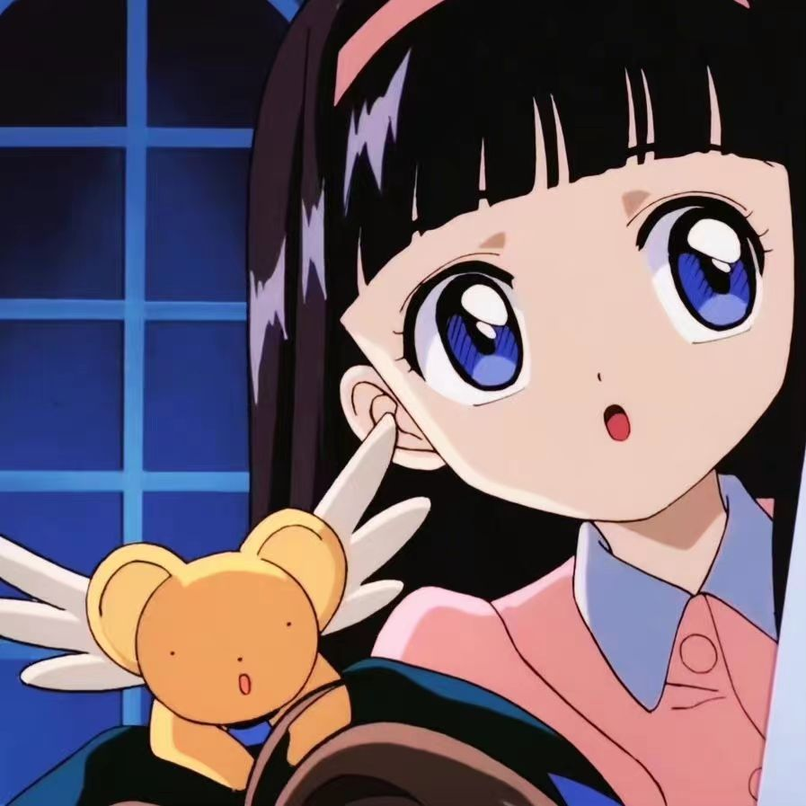

# 小晴的AI影视妙妙屋

本地运行的 AI 视频创作无限画布桌面应用。它把剧本、分镜、角色、图片、视频、声音和导出流程拆成可串联节点，让你用自己的外部 API 模型搭建一条完整的 AI 影视制作流水线。

<p align="center">
  
</p>

## 下载使用

最新版本：`v0.1.8`

Windows 安装包下载：

[前往 GitHub Releases 下载](https://github.com/eatguoking/xiaoqing-ai-video-house/releases/latest)

下载 `xiaoqing-ai-video-house-setup-版本号.exe` 后安装即可使用。首次启动后，需要在应用内配置你自己的外部 API；本项目不内置模型，也不内置 API Key。

## 适合谁

- 短剧、广告片、AI 视频创作者
- 需要把剧本、分镜、图片、视频生成串成流程的人
- 想在一个本地桌面应用里自由切换不同外部模型的人
- 想沉淀提示词、Skill 和素材资产的个人工作流用户

## 核心功能

### 无限画布工作流

- 用节点组织创作流程：剧本、分镜、角色、图片、视频、语音、导出
- 节点之间可拉线串联，上游输出可作为下游输入
- 支持从桌面拖入图片、视频、音频等本地文件，自动生成对应节点
- 支持节点内容预览、放大查看和文本编辑

### 外部 API 模型配置

- 剧本生成、图像生成、视频生成三类 API 独立配置
- 支持自定义 `Base URL`、API Key、模型名称和请求路径
- 支持接口调试，用于检查 API 是否通畅
- 模型选择列表会同步已配置 API 获取到的模型，不固定内置模型

### Skill 库

- 可配置可复用的生成策略、提示词包装模板和输出格式
- 支持从桌面拖入 `.json`、`.md`、`.txt`、`.prompt`、`SKILL.md` 或 `.zip` 压缩包导入 Skill
- 节点可多选 Skill，也可以开启自动识别，让应用按节点类型和输入内容匹配合适 Skill
- 适合沉淀短剧增强、分镜拆解、图片提示词优化、视频运镜优化、角色一致性等能力

### 素材与资产

- 底部资产库统一管理 AI 输出和本地导入素材
- 支持点击放大查看素材内容
- 支持把素材拖回画布，自动生成对应节点
- 分镜内容可提取人物、道具、场景等关键素材，并按顺序生成图片节点

### 桌面应用与自动更新

- 基于 Electron 封装为 Windows 桌面应用
- 支持 GitHub Releases 自动更新
- 用户项目数据、API Key 和素材保存在本机用户目录

## 典型工作流

1. 配置剧本、图片、视频三个类别的外部 API。
2. 在画布创建剧本节点，输入故事方向并生成剧本。
3. 从剧本节点创建分镜节点，读取上游剧本文本并拆分镜。
4. 从分镜提取关键人物、道具、场景素材，生成图片节点。
5. 选择图片节点生成视频节点，设置比例、分辨率、时长和镜头运动。
6. 导入本地音频或配音文件，最后整理时间线并导出。

## 本地开发

```bash
npm install
npm run db:init
npm run dev
```

打开 `http://localhost:3000`。

## 桌面打包

生成本地免安装版：

```bash
npm run desktop:pack
```

生成 Windows 安装包：

```bash
npm run desktop:dist
```

产物在 `release/` 目录。

## GitHub 自动更新发布

发布前确认 `package.json` 的版本号已经升级，并确保环境变量里有具备 Release 权限的 GitHub token。

```bash
set GH_TOKEN=你的 GitHub token
npm run desktop:release:github
```

桌面版会读取 GitHub Release 里的 `latest.yml`，检测新版本并下载更新。

## 安全说明

- 本项目不内置模型、不内置 API Key，所有模型由用户自行配置。
- `.env`、`prisma/dev.db`、`release/`、`.next/`、`node_modules/` 不会提交到 GitHub。
- 安装包内只包含空模板数据库 `prisma/app-template.db`。
- 用户自己的 API Key、项目数据和生成素材保存在本机用户目录，不会进入源码仓库。
